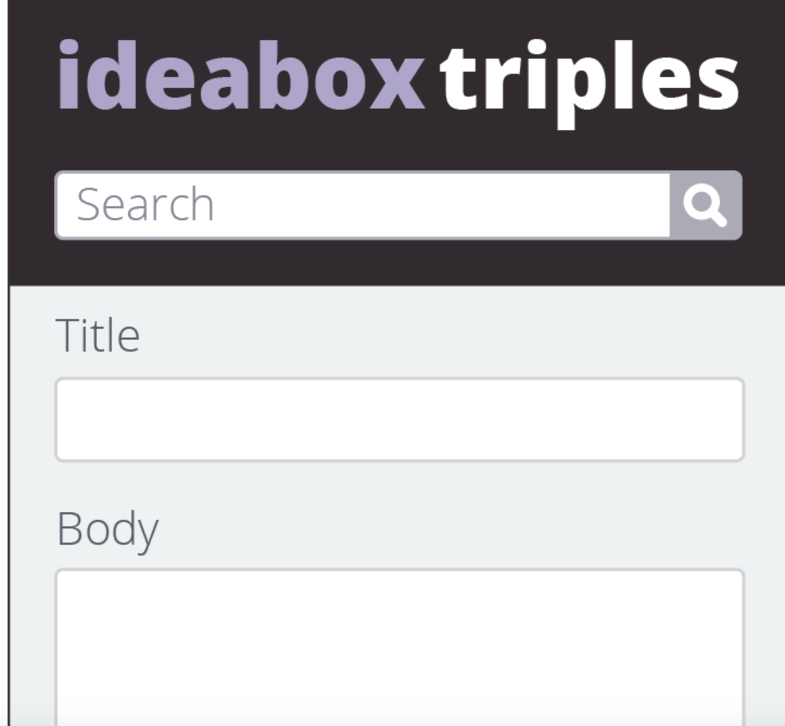
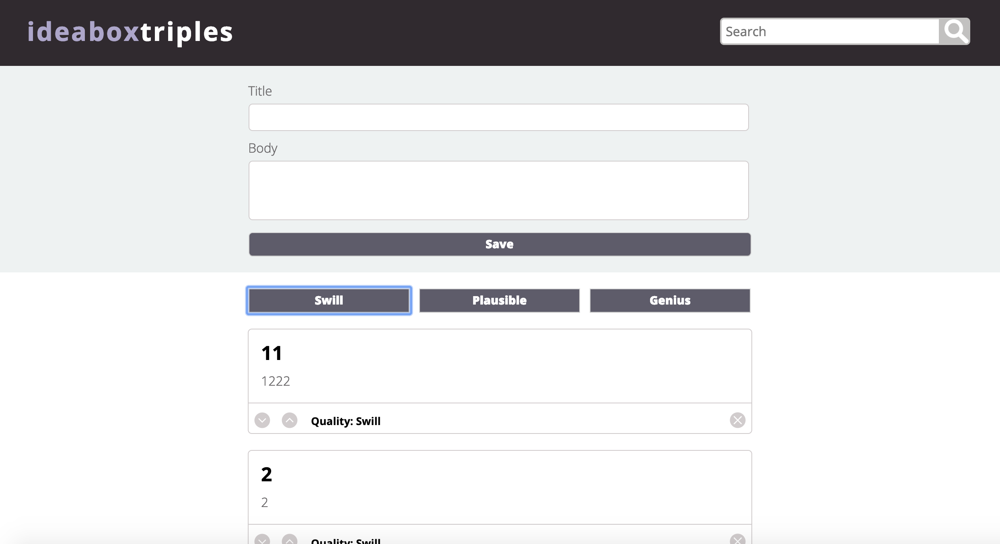
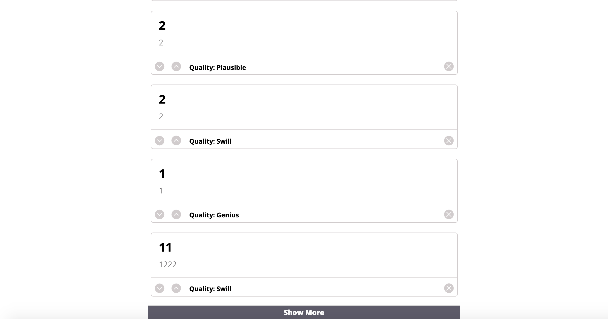
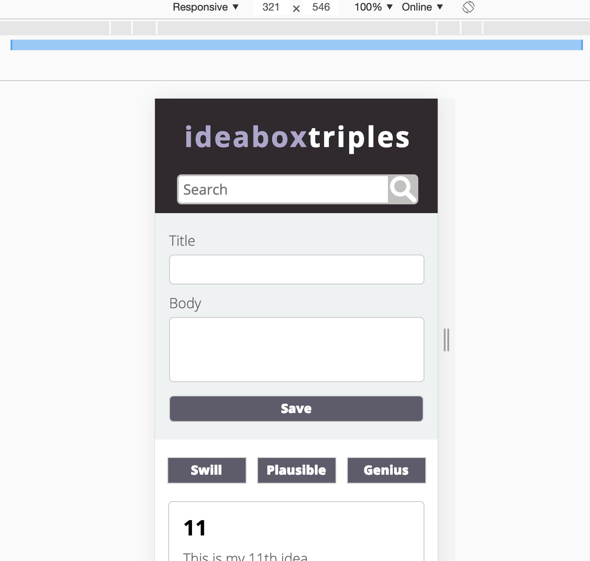
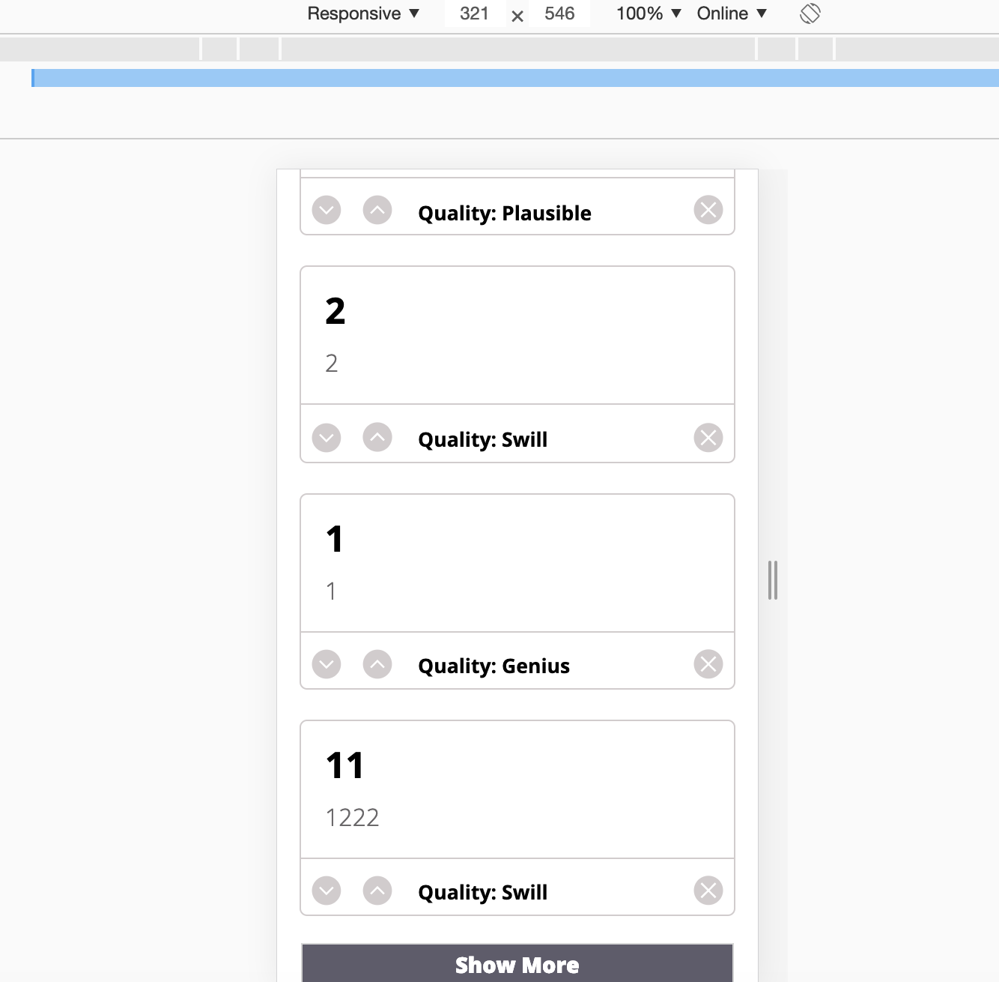

# Ideabox triples
### by Nim Garcia, De'Marcus Kirby (aka the great one), Ebenezer Jay Ingalsbe
## Intro

	For this project we recreated a website that takes ideas in a text field and saves them to another place on the site. We followed details of design and layout per the comp that was given to us. And added the functionality for the user.

	The user will type in the title of their idea, and the actual idea in the text field below the title. After entering the idea, the user will click the 'save' button and that idea is saved to a space below it. After creating an idea the user has the option of editing the idea, deleting the idea (permanently), or changing the quality. There are three qualities (swill, plausible and genius) that the user can choose for each idea. The user can also search their ideas via title, body or quality.

## Goals accomplished

1.	Implemented client side data persistence using local storage.
2.	Established and used two data models, one being a class.
3.	Iterated over DOM elements to filter what was displayed.
4.	Made dry clean code.
5.	Used only one media query.
6.	Had fun working as a team.

### Here is the original comp and our project screen shots

